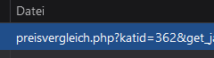

# Münzen-Crawler
Sammelt Informationen von gold.de über konfigurierte Münzen und 
gibt eine Übersicht im csv-Format aus.

## Usage

* Python3 installieren.
* Packages aus `requirements.txt` installieren.
* Münzen in Münzenkonfiguration hinterlegen (Beispiel):

| Münzenname     | Jahrgang | Kategorie-ID |
|----------------|----------|--------------|
| American Eagle | 2023     | 15           |
| Arche Noah     | 2012     | 143          |

Um die Kategorie einer Münze des Webshops zu bekommen, muss man den Netzwerkrequest 
beim Button "Neu Laden" im Presivergleich auslesen. Der Parameter `katid` ist die gesuchte Kategorie-ID.



```bash
python main.py <MÜNZENKONFIGURATION> <OUT-DATEI>
```

```bash
python main.py muenzen.csv out.csv
```

Zum Zeitpunkt der Veröffentlichung gibt es keine `robots.txt`, in der um Unterlassung des Crawlens gebeten wird.